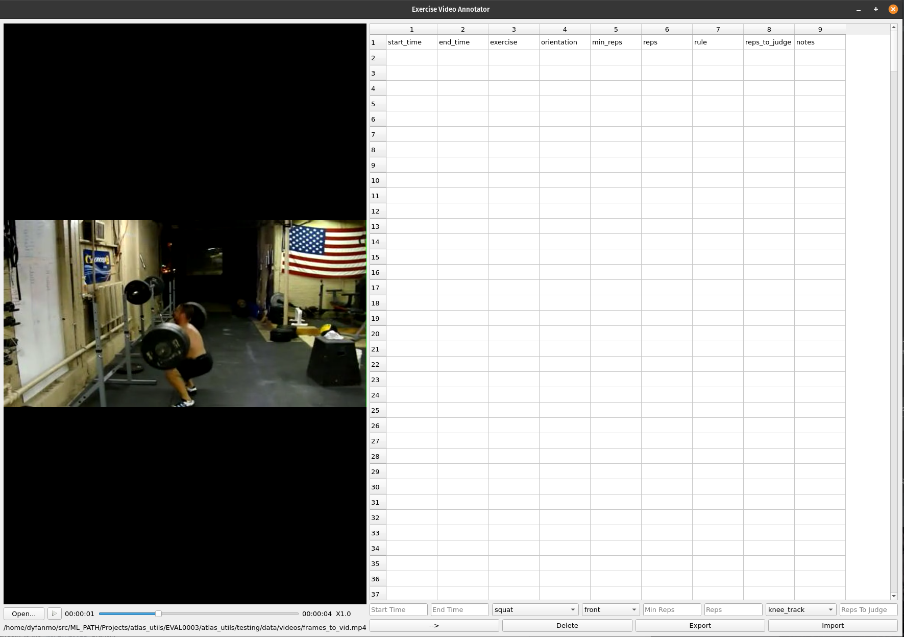

# Exercise Video Annotator
A simple video labelling tool developed in PyQt5 for exercise videos.

Annotate videos in common formats(ts, mp4, avi, mkv, wav, mp3)

The table in the exercise video annotator is used to input and store the labels for each exercise. The data in the table can be exported and imported into a CSV File.  The data is then transformed before exporting, converting the times to frame number and generate unique labels for each exercise.



## Installation
 ### Windows
 Run [Required software for Windows/K-Lite_Codec_Pack_1532_Basic.exe](Required%20software%20for%20Windows/K-Lite_Codec_Pack_1532_Basic.exe) file to support video
  ```
     pip install -r requirements    
```

 ### Linux/Ubuntu/MacOS
  ```
     pip install -r requirements    
```
 
## Usage
   * Running the annotator
 ```
     python pavs.py
```
   * You can use a list of preset exercises to choose from in the labelling tool. In this case use:
   ```
     python pavs.py --classes_label_path config/classes.txt
```

## Shortcuts
- Load video: L
- Previous frame: Left Arrow
- Next frame: Right Arrow
- Add Start Time: [
- Add End Time: ]
- Frame after next 10 frames: Shift + Left Arrow
- Frame before prev 10 frames: Shift + Right Arrow
- Increase playback speed: +
- Decrease playback speed: -
- Increase rep count number: I
- Decrease rep count number: D
- Copy Previous Row: C
- Add New Row: R
- Submit Values: ↵ 

## Notes
- To delete a row click the index number of the row you want to delete, then press the delete button
